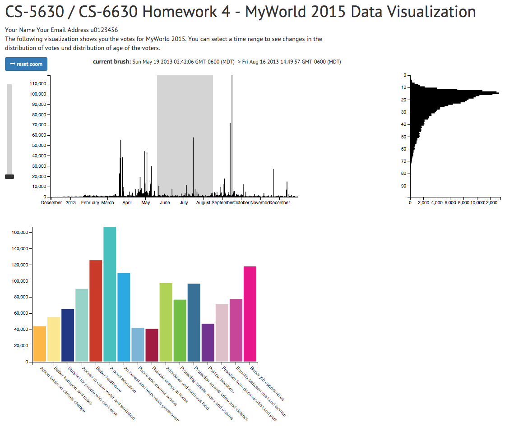

Homework 4
===
*This homework is due on Tuesday, October 6, 11:59 PM. Value: 6%*

In this homework assignment you will create another interactive visualization using [D3.js](http://d3js.org). This time, you will gain a little more exposure to data wrangling, as well as a few more interaction techniques. You will also be working in an example of a larger project that utilizes other libraries and frameworks like jQuery and Bootstrap (while you are not required to learn how to use them, reading and experimenting is encouraged!). While you will end up writing only a small amount of code for this assignment, there is much more to read. Also keep in mind that you will only have a week and a half to finish it, so make sure to get started in time.

For this assignment you will use data from the United Nations [MY World 2015](http://www.myworld2015.org/?page=about-my-world) vote project. MY World is a global survey commissioned by the UN Millennium  Project. It aims to capture people's opinions, priorities, and views on major issues, so that global leaders can be informed as they begin the process of defining the new development agenda for the world. Individuals are asked which six of sixteen possible issues they think would make the most difference to their lives. The sixteen issues are based on the priorities expressed in previous research and polling exercises. They cover the existing Millennium Development Goals and add issues of sustainability, security, governance and transparency.
The data is collected using the [MY World webpage](http://www.myworld2015.org/), text messages, and printed surveys.

You will add interactivity and improve a system that allows interactive selection of time slices of the poll data from the years 2012 and 2013. For the selected time period, the visualization will show the amount of votes per priority/choice from the poll data in addition to a histogram of the participants' age for the given selection. The image below shows the final product:

<p align="center">
    
</p>


After completing this homework you will be able to:

  - Select subsets of your data via brushing.
  - Create an event handler to connect interacting parts of your project.
  - Integrate zooming into your visualizations (extra credit only).
  - Have a sense for what a larger visualization project looks like, and have learned a few useful conventions for programming in Javascript.
  
## Conceptual and Technical Background

This homework will bring you a step closer to implementing complex designs, such as your final project. In the following, we introduce several concepts and techniques that will make it easier to do this.

### Divide and Conquer

Unlike previous assignments, the source code is split into several different source files, each corresponding to either a "class", or the main script that manages the application. There are many good ways to do object-oriented programming in Javascript (and plenty of bad ones); this homework shows just one approach.

This methodology of splitting up your project into subtasks and testing subtasks (in their own independent files) individually will become very helpful for developing larger systems.

### Structure is Key

We provide you with a framework of how to organize a multiple coordinated view system and encourage you to stick with it for the assignment. This framework includes stubs for organizing individual visualizations into objects and a way to let them communicate with each other. Thinking about the structure of your project can save you a lot of time and make your implementation more robust, extensible and reusable. A simple structure as shown in the following figure can achieve that already.

<p align="center">
    
</p>

### Files and Folders:

This homework comes with several files and folders that provide the framework and scaffolding for your implementation and includes many valuable comments on how to achieve the various tasks. The important files and folders are:

- **index.html**, the main file that contains all views.
- **js/** contains the files for the three visualizations, as well as
- **js/main.js**, the main script that coordinates all views. In here the individual visualizations are instantiated and linked via an eventHandler.
- **libs/** contains external libraries.
- **data/** contains the data files.
- **css/** contains the stylesheet files.
- **answers.md** is where you will answer a few text questions.

Additionally, the files:
- **1_tasks.html**, **/3_tasks.html**, and **js/tester.js** will help you develop and test small parts of the code in a small, controlled setting. We won't look at these for grading, but they should help you make sure you understand concepts before you add stuff to the larger project.

## Part I: Loading and Wrangling Data

The original MY World data is described at [http://dataset.myworld2015.org](http://dataset.myworld2015.org). Please read the description carefully and get acquainted with the original data fields. We have already aggregated and transformed the data to make the data format a better fit to the tasks we want to perform. Here is an annotated sample from the file **perDayData.json**:

```javascript
  {
        "day": "2014-05-27",    // date in format: "YYYY-MM-DD"
        "count(*)": 1764,       // number of all votes for this day
        "sum(p0)": 91,          // number of votes for issues given Priority 1
        "sum(p1)": 185,         // number of votes for issues given Priority 2
        "sum(p2)": 171,
          ...
        "sum(p15)": 535,        // count of votes for issues given Priority 16
        "education": [          // counts for different education level
            {
                "education": 1,     // education level 1 (some primary) has..
                "count(*)": 33      // .. a count of 33
            },
            ...
            {
                "education": 4,     // education level 4 (finished secondary) has..
                "count(*)": 1013    // .. a count of 1013
            }
        ],
        "age": [                // counts for ages of participants
            {
                "age": 2,           // age 2 has..
                "count(*)": 3       // .. a count of 3 -- mhh ??
            },
            {
                "age": 3,           // age 3 has..
                "count(*)": 1       // .. a count of 1 -- really ??
            },
            ...
            ]
}
```

Some contextual information: 

- All data is aggregated **per day** (`"day"`) for all days in 2012 and 2013.
- The count of all votes on this day are stored in the field `"count(*)"` 
- The counts of all votes for priority 1 (`"sum(p0)"`) to priority 16 (`"sum(p15)"`) are accessible by the field names given in brackets. Mind the difference in indexing priorities  (priority **1** correponds to p**0**).
- The daily sums of votes for different education levels of participants are stored in the array `"education"`. Each object in this array represents one education level (field `"education"`) and it's respective count (field `"count(*)"`)
- Equivalent to education levels, counts for each year of age are stored in the array `"age"`.

Make sure to unpack the file `data/perDayData.json.zip` as `data/perDayData.json`.

A second file (**MyWorld_fields.json**) contains meta-information about our data. For now, we are interested in the `"priorities"` object that gives us information for each priority. Again, the priorities are numbered from 0 (priority 1) to 15 (priority 16). You can easily access information for priority 6 via `priority["5"]`. 

Here is a sample:

```javascript
"priorities":{
      "15": {
        "item-color": "#E8168B",
        "item-title": "Better job opportunities",
        "item-content": "This means that governments ..."
      },
      "5": {
        "item-color": "#47C0BE",
        "item-title": "A good education",
        "item-content": "This means that all children should have ..."
      },
      ...
 }
```

The following information is given for each priority:

- The color of the priority on the survey webpage (`"item-color"`).
- A short name for the priority (`"item-title"`).
- A longer description of the priority (`"item-content"`).

### Implementation Tasks
These two tasks will help you in getting acquainted with loading more than one file at a time and in thinking about ways to aggregate values for a given time-range. The time-range will be dynamically defined by a user selection in the later tasks. 

To check whether your code delivers what is expected we included a simple test mechanism. You will find detailed instructions in the file [1_tasks.html](1_Tasks.html). Implement tasks 1a and 1b in `1_tasks.html` first, later you will integrate the code into your actual MCV system. 

*Note that the test HTML files are only there to help you. We grade your solutions in the visualization.*

#### Task 1a: Asynchronous Data Loading

Load the json files **MyWorld_fields.json** and **perDayData.json** and bind their content to the objects `metaData` and `allData`. Call the method `allLoaded(perDayData, metaData)` after **BOTH** files have been loaded. 

Hint: remember the asynchronous behavior of Javascript. A library called [d3-queue](https://github.com/mbostock/queue) will be helpful here. You can find an very helpful example of how it is used [here](http://giscollective.org/d3-queue-js/).

#### Task 1b: Aggregation 
Implement the function `aggregateCountForRange(from, to)`. This function takes two dates as parameter - the start date and the end date of a date range. The function should aggregate the `count` values for the given time range.

Once you have completed task 1a and 1b, your [1_tasks.html](1_tasks.html) file should produce an output similar to what is shown below. 


Once your test cases work, add the code to the appropriate places in the visualization system. Load the data in the starting part of main.js and put the aggregation logic in priovis.js and aggregate on priority count values for the selected time range. After this, all the views should appear!

## Part II: Making an Area Chart Interactive with Brushing & Zooming

The data set contains the total count of votes for each day (`"count(*)"`). In this part of the assignment you will add a brush to the visualization that plots the number of votes per day and add a slider for non-linear scaling of the y-axis to reveal patterns that are lost using a linear scale. As a bonus task, you can make the visualization zoomable along the x-axis.

We have implemented this view for you in `countvis.js` (minus, of course, the brushing, the y-axis deformation and the zoomable x-axis).

### Brushing in D3 

In D3, a brush is an interactive area where clicking and dragging of the mouse is interpreted as a selection of a range (in D3-lingo, this is called *extent*). The range selection can be used to make changes to the visualization. The extent of the selection is shown as illustrated in the following image. Note that the area where you can click and drag to initiate a brush is shown in blue, while the visible representation of the brush is shown in gray. Check out the [D3 Brush API](https://github.com/mbostock/d3/wiki/SVG-Controls).

<p align="center">

</p>

You can create a brush with the code below. The brush takes a D3 scale as function for converting the range of a selection in the visualization space into a range of the data space. You should use the same scale for this brush as you used for drawing the axis and drawing your visual encoding. The `.on()` function takes a function as a parameter that is called when a brush event happens. Here a function called "brushed" is called each time the brush is used to select data:

```javascript
var visScale = d3.time.scale().domain([new Date("2014/12/3"), new Date("2014/12/12")]).range([0,500])
var brush = d3.svg.brush().x(visScale).on("brush", brushed);
```

A brush is added using the following command. 

```javascript
svg.append("g").attr("class", "brush").call(brush)
  .selectAll("rect").attr({
    height: bbVis.h
});
```

The `brush` function is called on a group element (`<g>`) and creates some DOM elements. Then, all the `<rect>` elements in this group are given a height. In order to understand what we are doing, let's have a look at the brush itself in the DOM tree. As described earlier, the brush consists of a mouse-sensitive area and a visual representation of the brushed area. To answer the questions below, we encourage you to implement a brush in a temporary file (you don’t need to submit this file.)


#### Questions 
**Please answer in file ```answers.md```.**

Take a look at the elements that are added to the `<g>` element.

- **Question 2a:** Name the HTML element (type and class) that represents the interactive area.
- **Question 2b:** Name the HTML element (type and class) that is used for representing the brushed selection.
- **Question 2c:** What do the other DOM elements of brush represent? 

We want to use the brush to choose the data to show in the other views. As mentioned before, whenever a brush is changed, the function `brushed` is called. In this function, we want to change the detail visualizations to only show the data for the selected time frame. 

We have created an area chart in the file ***js/countvis.js*** for you. Make sure you understand the code and check out [d3.svg.area()](https://github.com/mbostock/d3/wiki/SVG-Shapes#area) and the d3 path functions again, if something is unclear. A useful guide can be found [here](http://www.d3noob.org/2013/01/filling-area-under-graph.html).

#### Task 2a: Implement Brushing

Create a brush that reacts to mouse interactions on top of your created visualization and that looks and behaves as illustrated in the animated figure below. During brushing, a newly created function `brushed()` should be called.


Note that your bars in the lower chart will not (yet) react as shown in this figure.

#### Task 2b: Non-linear scale deformation

A linear mapping can be expressed as
<p align="center" style="font-size:10pt;">
<br/>
linear mapping of data values to display size
</p>

Mapping data onto a linear scale has the disadvantage that fluctuations of low values can be hard to see.
To address this problem, many visualizations use a non-linear scale. The most common non-linear scale is a logarithmic scale, where the original values are transformed by a logarithmic function. 
<p align="center" style="font-size:10pt;">
<br/>
logarithmic mapping of data values to display size
</p> 

See, for example, the [Semi-log plot](http://en.wikipedia.org/wiki/Semi-log_plot). 

This method has two drawbacks: the logarithmic function is usually not parameterizable, and the value of *log(0)* is infinite.

We will use a power scale ([d3 link](https://github.com/mbostock/d3/wiki/Quantitative-Scales#power-scales)) that transforms the data by taking it to the power of an exponent. 
<p align="center" style="font-size:10pt;">
<br/>
mapping of data values to display size with power scale. Parameter e is usually smaller than 1.
</p> 

The exponent is a parameter that can be adjusted, e.g., using a slider.

File **js/countvis.js** already includes a simple functioning slider created with the help of d3 dragging behavior (see function `addSlider()`). Whenever the slider is moved a function `sliderDragged()` is called. Your task is to convert the y scale of your area plot into a power scale that lifts the lower areas up when moving the slider upwards.
<p align="center" style="font-size:10pt;">
    <br/>
    **Figure 2c:** A slider controls the distortion of the y axis.
</p>

#### Bonus Task 2c: X-Axis Zoom

The x axis in our visualization is very dense. Make it zoomable along the x axis by mouse-scroll when the mouse cursor is over the chart area. Make sure to update the brush accordingly. This isn't quite easy, there is a trick needed to allow zooming and brushing on the same objects - if you’re stuck here, don’t waste too much time. 
<p align="center" style="font-size:10pt;">
    <br/>
    Using the mouse-wheel to zoom in and out.
</p>


## Part III: Reactive Detail Visualizations with Event Propagation 

In this section you will hook up the two visualizations that react to the brush selections, the visualization of age distribution of voters, and the visualization of the priorities.

Each visualizations is an object that follows the pattern we described before. See the example of how the vote-count visualization (CountVis) (['js/countvis.js'](js/countvis.js)) is conceptually constructed:

<p align="center">

    
</p> 

### Event Handler 

To connect the three views we will make use of an event handler. Instead of being directly connected with each other the views talk to each other via a mediator. A popular analogy of this principle is the Twitter service. For example, Homer follows (*binds* himself to) Bart. Once he has done that, Homer will be notified every time Bart tweets (```triggers``` a message event), Homer and all other followers get notified. However, Bart is only notified of Homer's tweets when he also explicitly subscribes to Homer. Applied to our visualizations that can be imagined as:

<p align="center">
    
</p> 

To implement the event handler we will use the [D3 event handling mechanism](https://github.com/mbostock/d3/wiki/Internals#events)

In this example, `var eventHandler = d3.dispatch("selectionChanged");` we create a new event handler with an event type `selectionChanged`. We can then set a callback function for the event handler like this:

  `eventHandler.on("selectionChanged", myFunction)`
   
In `myFunction` we can react to the event. `myFunction` should be set to the `onSelectionChange` function. 

In this homework, an event should be generated whenever the brush selection changes in the count visualization. This event will be consumed by the event handler, which will subsequently call the `onSelectionChange(startData, endDate)` function for each of the registered visualizations (AgeVis, PrioVis).  

You can try out what to do in the following tasks in the file [3_tasks.html](3_tasks.html), an other test-case, before you move this to the appropriate places in the visualization code. Note that this is optional.

### Task 3a: Prepare CountVis 
Create an event handler in ***js/main.js*** and trigger an event called `selectionChanged` during brushing (remember which function is called during a brush) in ***js/countvis.js***.

### Task 3b: Hook the Age Distribution up to events.

Use the event handler and the aggregation function to integrate this visualization so that it adapts to changes in the brush selection. Bind the `onSelectionChange(startDate, endDate)` method to listen to the '*selectionChanged*' from the event handler in ***js/main.js***. 

### Task 3c: Hook the Visualization for Priorities Distribution (PrioVis) up to events.

To update the scale and the distribution of votes when the user selects a new time window you should bind the `onSelectionChange(startDate, endDate)` method to listen to the '*selectionChanged*' event. 

## Part 4. Comparative Visualization

The goal of this problem is to enhance the visualization to address the following task: In our visualization the data in the priority issue visualization and the age distribution visualization changes based on the selected time range. Whenever we change the selection (by brushing), the values and scales change. The number of changes that happen during brushing make it nearly impossible to track them all. To overcome this limitation (at least partially) you should develop designs that allow comparisons of values in the priority issue visualization. 
There are two options for comparisons: we can compare data of two selected time-intervals, or we can compare the selected data against overall averages.

### Task 4a: Design
Choose a comparison scenario and create at least two alternative designs that would allow this comparison. Include pictures of your design and brief descriptions of them in a file with the name `4_design.pdf`.

### Task 4b: Implemtation
Implement one design in your visualization for the priority issues.

### Task 4c: Analysis
Submit a screenshot of an interesting pattern which you have found with your method and briefly describe the pattern. Add this to your design pdf file.
  
**We will  give a bonus to stellar implementations of excellent designs.** 

-- 
## Grading

Your score on this assignment will be as follows:

25%: Part I, data wrangling. <br />
20%: Part II, Brushing Scales. <br />
20%: Part III, Events. <br />
35%: Part IV, Comparative Visualization. <br />
5%: Bonus 2c, X-Axis Zooming. <br />
5%: Bonus 4, Excellent design solution and implementation. <br />
