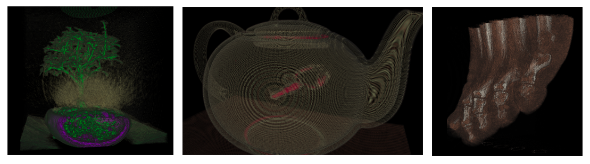

Homework 6
===
*This homework is due on Friday, October 30, 11:59 PM. Value: 10%*

In this homework you will develop a volume renderer. Volume rendering works through ray casting. As a ray intersects the volume, you determine for each voxel how much it contributes to the final image (transparency) and what color it is. This mapping is driven by a transfer function. 

We have provided a volume renderer for you, but it is not very good, it only renders the exterior of the volume. Your task is to (a) implement the ray-casting algorithm and (b) design a good transfer function widget, so that you can interactively specify your own transfer function and reveal all the hidden information in the volumne. Finally, you can implement lighting, which will make your scene look much better.

With a decent transfer function and a complete implementation (including the bonus), the volumes should look something like this:



Note that the transfer function widget part of this homework is much more open-ended than the previous homeworks, we provide no scaffold for you except for the interface to the volume renderer.

## Technical Details

This assignment consists of two separate tasks. The first is to modify the GLSL shader pseudocode to perform direct volume rendering (instead of its current behavior, which just renders the outside color of the volume bounding box). The second is to design the transfer function editor in D3. These tasks are orthogonal; you can complete one without the other. Of course, you will get nice results only if you do both.

The example code that we have given you logs a histogram to the console each time you switch volumes in the renderer. Each object in the array represents a bin; the `count` value tells you how many voxels have a value between `lowBound` and `highBound`.
The information in this histogram is very important for guiding the user to potentially
interesting structures in the data, you might want to use this somewhere in your design.


## Task 1 - Volume Rendering

Volume rendering will be implemented as a ray caster inside a WebGL shader. This will be written in the OpenGL shading language, GLSL (specifically, the GLSL ES, ES here stand for "embedded systems"). A "cheat sheet" for programming GLSL can be found [here](https://www.khronos.org/files/opengl44-quick-reference-card.pdf), more information is available in [this tutorial](https://www.opengl.org/sdk/docs/tutorials/TyphoonLabs/Chapter_1.pdf).

Theoretical background for volume rendering is covered in the assigned reading [Real Time Volume Graphics](http://webdocs.cs.ualberta.ca/~pierreb/Visualization2006/Real-Time-Volume-Rendering.pdf) Chapters 1--3; a practical ray casting implementation is provided in the tutorial slides [here](http://www.cg.informatik.uni-siegen.de/data/Tutorials/EG2006/RTVG04_GPU_Raycasting.pdf) (in particular, slides 1--8).

The WebGL shading language "ELSL" implements a subset of the OpenGL specification, and does not support several features, including actual 3D texture sampling. However, we can still implement a basic volume renderer by linearly interpolating 2D textures, similar to the 2D slicing approach detailed in Chapter 4 of [Real Time Volume Graphics](http://webdocs.cs.ualberta.ca/~pierreb/Visualization2006/Real-Time-Volume-Rendering.pdf). To make the assignment far simpler, we have provided this for you, in reference code based on the WebGL tutorial [here](https://github.com/lebarba/WebGLVolumeRendering). Both this and our assignment are based on [three.js](http://threejs.org), a WebGL interface library for Javascript. 

Volume rendering is the process of classifying and blending multiple discrete samples along the ray. Tutorials abound on the internet; however for the purposes of this assignment you may find it more useful to refer to the existing code in [shaders/fragmentShaderSecondPass.frag](shaders/fragmentShaderSecondPass.frag). 

This code provides the following pieces which you can use:

- The *inteprolation function*, which returns an interpolated value at an arbitrary point in space on [0,1]^3.
 `float sampleAs3DTexture(vec3 texCoord)`
- The classification function, which applied a (1D) transfer function to the color value,
  `vec4 classify(float value)`
- The origin and direction of the ray, 

  ```
  uniform vec3 origin;
  vec3 dir = backPos - frontPos;
  ```
- variables for accumulating (blending) color and opacity, respectively:

  ```
  vec4 colorSample;
  float alphaSample;
  ```

Given these, we would like to write a volume render as a loop, roughly as follows:

```
for all samples t from the front to the back of the box
  compute the position of the current sample, using ray origin and direction
  interpolate and classify the sample to find a color
  composite the color sample
```

Compositing involves alpha blending the color samples as follows:

```
accumulatedColor += (1.0 - accumulatedAlpha) * colorSample * alphaSample;
accumulatedAlpha += alphaSample;
```

Putting these together, the assignment consists of two tasks:

**Task 1a**. Modify the `main()` function in shaders/fragmentShaderSecondPass.frag to perform volume ray casting instead of rendering the exterior of the volume bounding box.

**Task 1b** (*Extra Credit*): As a bonus, implement gradient-based lighting, higher-order filtering or other optimizations for direct volume rendering.

## Task 2 - Transfer Function Widget Design & Implementation

Desiging a good transfer function widget is a non-trivial task; it's arguably an open research
problem! How can the user tell your system which structures they want to visualize inside a cube
of numbers?

Many existing volume rendering software packages actually do this very poorly! As much as you can,
try to not let examples that you've already seen bias your creativity. This is a design problem, not a
math problem: **there are many valid solutions!** For grading, it's probably best to think of us
as art critics, rather than someone following a strict rubric. If your design
looks and feels like something that already exists, we will probably be pretty nitpicky about
technical, design, and aesthetic flaws; we'll expect a really high-quality submission. If, however,
you are trying something new and creative (that might fail), we will be much more forgiving.

**We will give a bonus to stellar implementations and/or excellent designs.**

### Task 2a: Design
Sketch at least three designs for a way for a user to specify a transfer function. Include pictures of your design and brief descriptions of them in a file with the name `design.pdf`.

### Task 2b: Implementation
Implement one design. Ideally, you should only need to edit `script.js`, or add your own Javascript
files (you shouldn't need to edit anything in the `lib/` directory, unless you're really brave and
want to derive more from the voxel data than just a histogram).

Whatever your solution is, you should define sensible default values for your transfer function, and make sure that it is easy for us to discover all the features. If you have a subtle feature, make sure to point us at it so we can consider it when grading.

If you are attempting something difficult and you find that you hit roadblocks in your implementation,
be sure to document what you *wanted* to do, and, to the best of your ability, describe *why* the
technology isn't allowing you do it. Be sure to include these details in your `design.pdf` submission.

We can't stress enough how important this documentation is, especially if you're trying
something new and creative. It's possible that *only* submitting your `design.pdf` could
receive a very high portion of the marks (though unlikely; we want to see that you at least made an honest effort to implement your wild, crazy idea).

## Task 3: Analysis
Submit at least one screenshot of interesting structures that you discover in each volume with your widget, and discuss strengths and weaknesses of your design. Add this to your `design.pdf` file.


## Grading

Your scores on this assignment will be weighted as follows:

35%: Task 1a: Working volume rendering. <br />
20%: Task 2a: At least three transfer function designs with pictures. <br />
35%: Task 2b: Implementation of one design and/or **thorough** documentation as to why the design or parts of it are infeasible. <br />
10%: Task 3: At least one screenshot, with discussion of strengths and weaknesses of your system. <br />
10%: Bonus: Excellent design solution and implementation, or implementation of volumetric lighting in Task 1b. <br />
